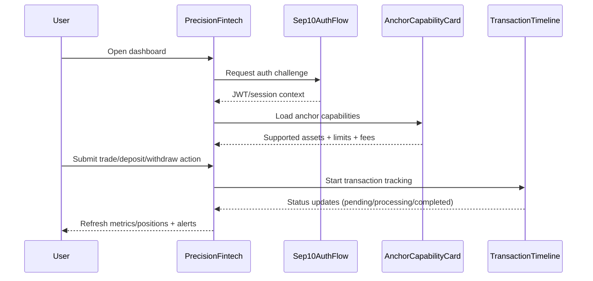

# API Request Panel Component

A reusable React component for displaying API requests and responses in AnchorKit applications.

## Features

- ✅ Display endpoint with HTTP method badge
- ✅ Show formatted request body (JSON)
- ✅ Display response with loading and error states
- ✅ Generate and display cURL command
- ✅ Copy to clipboard functionality for all sections
- ✅ Skeleton loader for async operations
- ✅ Error handling with visual feedback
- ✅ Dark mode support
- ✅ Responsive design
- ✅ Follows AnchorKit 8pt grid system

## Installation

```bash
# Copy the component files to your project
cp ui/components/ApiRequestPanel.tsx src/components/
cp ui/components/ApiRequestPanel.css src/components/
```

## Usage

### Basic Example

```tsx
import { ApiRequestPanel } from './components/ApiRequestPanel';

function MyComponent() {
  return (
    <ApiRequestPanel
      endpoint="https://api.anchorkit.stellar.org/v1/attestations"
      method="POST"
      requestBody={{
        issuer: 'GANCHOR123...',
        subject: 'GUSER456...',
        timestamp: 1708819200,
      }}
      response={{
        success: true,
        attestation_id: 'att_123456',
      }}
    />
  );
}
```

### With Loading State

```tsx
function SubmitAttestation() {
  const [response, setResponse] = useState(null);
  const [isLoading, setIsLoading] = useState(false);

  const handleSubmit = async () => {
    setIsLoading(true);
    const result = await contract.submit_attestation(...);
    setResponse(result);
    setIsLoading(false);
  };

  return (
    <>
      <button onClick={handleSubmit}>Submit</button>
      <ApiRequestPanel
        endpoint="https://api.anchorkit.stellar.org/v1/attestations"
        method="POST"
        requestBody={{ /* ... */ }}
        response={response}
        isLoading={isLoading}
      />
    </>
  );
}
```

### With Error Handling

```tsx
function ApiCallWithError() {
  const [error, setError] = useState<string>();

  const makeRequest = async () => {
    try {
      const result = await fetch(...);
      // handle success
    } catch (err) {
      setError(err.message);
    }
  };

  return (
    <ApiRequestPanel
      endpoint="https://api.anchorkit.stellar.org/v1/endpoint"
      method="POST"
      requestBody={{ /* ... */ }}
      error={error}
    />
  );
}
```

## Props

| Prop | Type | Required | Default | Description |
|------|------|----------|---------|-------------|
| `endpoint` | `string` | ✅ | - | The API endpoint URL |
| `method` | `'GET' \| 'POST' \| 'PUT' \| 'DELETE' \| 'PATCH'` | ❌ | `'POST'` | HTTP method |
| `requestBody` | `Record<string, any> \| string` | ❌ | - | Request payload |
| `response` | `Record<string, any> \| string` | ❌ | - | API response data |
| `headers` | `Record<string, string>` | ❌ | `{}` | HTTP headers |
| `isLoading` | `boolean` | ❌ | `false` | Loading state |
| `error` | `string` | ❌ | - | Error message |

## Features in Detail

### 1. Method Badges

HTTP methods are displayed with color-coded badges:
- **GET**: Blue
- **POST**: Green
- **PUT**: Yellow
- **DELETE**: Red
- **PATCH**: Purple

### 2. Copy to Clipboard

Each section has a copy button:
- Endpoint URL
- Request body (formatted JSON)
- Response (formatted JSON)
- cURL command (complete with headers and body)

Visual feedback shows when content is copied (✓ checkmark for 2 seconds).

### 3. cURL Generation

Automatically generates a complete cURL command including:
- HTTP method
- Endpoint URL
- All headers
- Request body (for POST/PUT/PATCH)

Example output:
```bash
curl -X POST \
  "https://api.anchorkit.stellar.org/v1/attestations" \
  -H "Content-Type: application/json" \
  -H "Authorization: Bearer <token>" \
  -d '{
  "issuer": "GANCHOR123...",
  "subject": "GUSER456..."
}'
```

### 4. Loading States

Uses skeleton loaders that match AnchorKit's design system:
- Animated gradient effect
- Multiple lines with varying widths
- Smooth transitions

### 5. Error Handling

Displays errors with:
- Warning icon (⚠️)
- Red background
- Clear error message
- Accessible color contrast

### 6. Responsive Design

- Mobile-friendly layout
- Stacks elements vertically on small screens
- Touch-friendly button sizes
- Horizontal scrolling for long code blocks

### 7. Dark Mode

Automatically adapts to system preferences:
- Dark backgrounds
- Adjusted text colors
- Maintained contrast ratios
- Smooth transitions

## Styling

The component uses CSS custom properties for easy theming. Override these in your global styles:

```css
.api-request-panel {
  --primary-color: #3b82f6;
  --success-color: #10b981;
  --error-color: #ef4444;
  --border-color: #e5e7eb;
  --background: #ffffff;
}
```

## Integration with AnchorKit

### With Skeleton Loaders

```tsx
import { ApiRequestPanel } from './components/ApiRequestPanel';

function AnchorOperation({ anchorAddress }) {
  const [skeleton, setSkeleton] = useState(null);
  const [response, setResponse] = useState(null);

  useEffect(() => {
    async function load() {
      const skel = await contract.get_anchor_info_skeleton(anchorAddress);
      setSkeleton(skel);
      
      if (!skel.is_loading && !skel.has_error) {
        const data = await contract.get_anchor_metadata(anchorAddress);
        setResponse(data);
      }
    }
    load();
  }, [anchorAddress]);

  return (
    <ApiRequestPanel
      endpoint={`https://api.anchorkit.stellar.org/v1/anchors/${anchorAddress}`}
      method="GET"
      response={response}
      isLoading={skeleton?.is_loading}
      error={skeleton?.error_message}
    />
  );
}
```

### With Session Tracking

```tsx
function SessionOperation({ sessionId }) {
  const [response, setResponse] = useState(null);

  const submitWithSession = async () => {
    const result = await contract.submit_attestation_with_session(
      sessionId,
      issuer,
      subject,
      timestamp,
      payloadHash,
      signature
    );
    setResponse(result);
  };

  return (
    <ApiRequestPanel
      endpoint="https://api.anchorkit.stellar.org/v1/attestations"
      method="POST"
      requestBody={{
        session_id: sessionId,
        issuer,
        subject,
        timestamp,
      }}
      response={response}
      headers={{
        'X-Session-ID': sessionId,
      }}
    />
  );
}
```

## Accessibility

- Semantic HTML structure
- ARIA labels on interactive elements
- Keyboard navigation support
- Screen reader friendly
- High contrast mode support

## Browser Support

- Chrome/Edge 90+
- Firefox 88+
- Safari 14+
- Mobile browsers (iOS Safari, Chrome Mobile)

## Performance

- Minimal re-renders with React.memo
- Efficient clipboard API usage
- Lazy loading of large responses
- Optimized animations

## Testing

```tsx
import { render, screen, fireEvent } from '@testing-library/react';
import { ApiRequestPanel } from './ApiRequestPanel';

test('displays endpoint', () => {
  render(
    <ApiRequestPanel
      endpoint="https://api.example.com/test"
      method="GET"
    />
  );
  expect(screen.getByText('https://api.example.com/test')).toBeInTheDocument();
});

test('copies cURL to clipboard', async () => {
  const writeText = jest.fn();
  Object.assign(navigator, {
    clipboard: { writeText },
  });

  render(
    <ApiRequestPanel
      endpoint="https://api.example.com/test"
      method="POST"
    />
  );

  const copyButton = screen.getAllByRole('button')[3]; // cURL copy button
  fireEvent.click(copyButton);

  expect(writeText).toHaveBeenCalled();
});
```

## PrecisionFintech

High-level portfolio dashboard component for fintech-style account monitoring, charting, and position management.

### Props Interface

| Prop | Type | Required | Default | Description |
|------|------|----------|---------|-------------|
| `metrics` | `PrecisionFintechMetric[]` | No | `DEFAULT_METRICS` | Summary cards at the top of the dashboard. |
| `positions` | `PrecisionFintechPosition[]` | No | `DEFAULT_POSITIONS` | Rows rendered in the positions table. |
| `chartData` | `number[]` | No | `DEFAULT_CHART_DATA` | Time-series values rendered by the performance chart. |
| `initialTab` | `'overview' \| 'analytics' \| 'history'` | No | `'overview'` | Initial active tab in the positions panel. |
| `headlineValue` | `string` | No | `'$2,847,391'` | Main hero value shown above the dashboard grid. |
| `headlineLabel` | `string` | No | `'Total AUM'` | Secondary hero label shown under the headline. |

### Supporting Types

```ts
export interface PrecisionFintechMetric {
  label: string;
  value: string;
  change: string;
  up: boolean;
}

export interface PrecisionFintechPosition {
  ticker: string;
  name: string;
  qty: number;
  price: number;
  change: number;
  value: number;
}
```

### Usage Example

```tsx
import { PrecisionFintech } from '@anchorkit/ui-components';

export function PortfolioScreen() {
  return (
    <PrecisionFintech
      headlineValue="$4,210,981"
      headlineLabel="Managed NAV"
      initialTab="analytics"
      metrics={[
        { label: 'Portfolio Value', value: '$4,210,981', change: '+3.2%', up: true },
        { label: 'Daily P&L', value: '+$21,103', change: '+0.5%', up: true },
        { label: 'Sharpe Ratio', value: '2.41', change: '+0.04', up: true },
        { label: 'Alpha', value: '14.9%', change: '+0.7%', up: true },
      ]}
    />
  );
}
```

### Integration Pattern

`PrecisionFintech` is commonly used as the shell around identity, capability, and transfer-progress flows.

Typical composition:
- `Sep10AuthFlow` for wallet authentication
- `AnchorCapabilityCard` for asset/rail eligibility
- `TransactionTimeline` for post-submit status tracking



### Test Coverage and Accessibility

- Test file: `ui/components/PrecisionFintech.test.tsx`
- Accessibility audit: `jest-axe` assertions are included in the test suite.
- Suggested coverage command:

```bash
npx jest components/PrecisionFintech.test.tsx --coverage --collectCoverageFrom=components/PrecisionFintech.tsx
```

## License

Part of the AnchorKit project.
